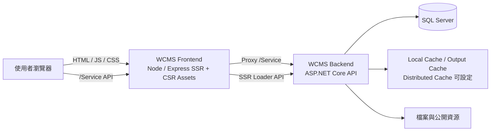
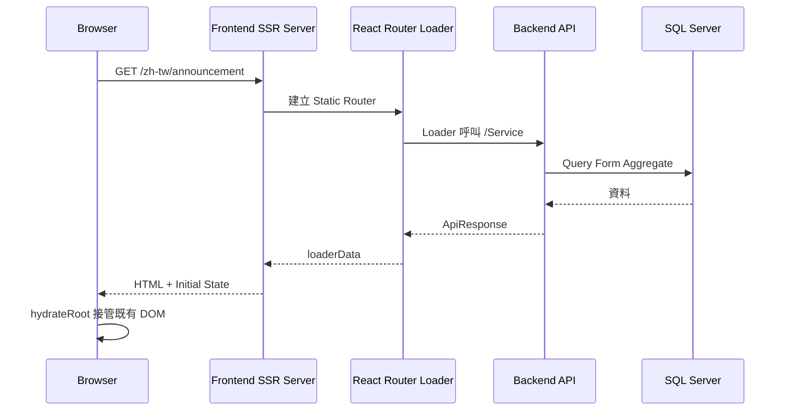
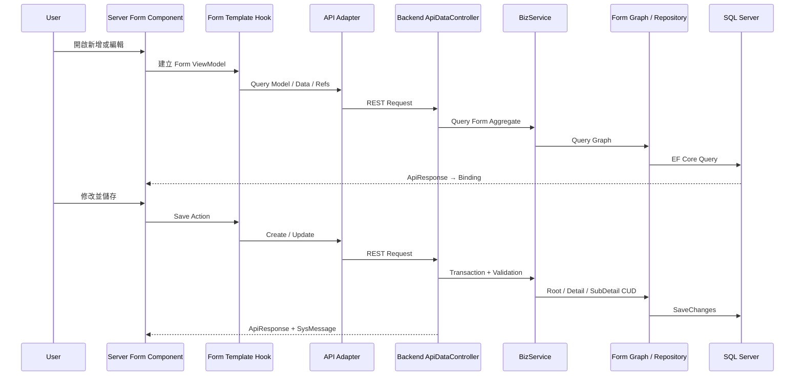

# WCMS 整體專案架構

> 文件版本：Version 1.1  
> 對標 Repository：`Saki2012/WCMS`  
> 對標分支：`Feature/Dev`  
> 最後確認：2026-08-20  
> 文件用途：提供開發者、Code Review、QA 與 AI 理解 WCMS 整體系統邊界與資料流。

> [!NOTE]
> 本文件以 `Feature/Dev` 的實際程式、建置設定、啟動入口與目前開發規則為依據。
>
> 已規劃但尚未全面落地的事項，會明確標示為「規劃中」；無法由目前程式確認的內容不納入既定事實。

---

## 1. 系統定位

WCMS 是一套前後端分離的網站內容管理系統，主要由下列部分組成：

```text
WCMS
├─ WCMS_Frontend
│  ├─ 前台網站
│  ├─ 後台管理介面
│  ├─ CSR／SSR 雙執行模式
│  └─ Feature／Spec 前端擴充
├─ WCMS_Backend
│  ├─ REST API
│  ├─ FeatureDriver 共用資料框架
│  ├─ IAM／WEB／COMM／MAT 等功能模組
│  ├─ SQL Server／EF Core Persistence
│  └─ Feature／Spec 後端擴充
└─ SQL Server
   ├─ WCMS 業務資料
   ├─ 多語系資料
   ├─ 權限與帳號資料
   └─ 稽核、初始化與舊資料轉換資料
```

目前系統主線是：

- 前端：React、TypeScript、Vite、React Router。
- 前端執行：CSR 與 Node／Express SSR。
- 後端：ASP.NET Core Web API。
- 資料存取：Entity Framework Core + SQL Server。
- API：目前以 RESTful API 為主。
- API 型別：由後端 OpenAPI Schema 產生前端型別。
- 身分驗證：JWT、Cookie、後端 Token State Cache。
- 多國語系：Route、Cookie、HTTP Header、後端 I18n Cache 共同處理。
- 客製化：Feature 共用主線搭配 Spec 專案延伸。
- 無障礙：前端 AA 操作與後端 CMS 內容檢查共同處理。
- 弱點掃描：前後端皆有安全標頭、XSRF、CORS、Cookie 與輸入防護。

---

## 2. Repository 與分支角色

目前 Repository 的主要程式分支包含：

```text
main
Feature/Dev
Feature/Release
Spec1810
Spec1816
Spec1817
Spec1818
Spec1819
Spec1820
Spec1821
```

分支角色依目前規範區分為：

| 分支類型 | 主要用途 |
|---|---|
| `Feature/Dev` | WCMS 共用 Feature、SysCore、一般功能與架構開發 |
| `Feature/Release` | 發布前整合、版本確認與必要 Hotfix；不作為日常一般開發分支 |
| `Spec####` | 指定客戶／專案的客製功能與版型 |
| `main` | Repository 預設分支；實際發布與合併策略另依 Git／Commit 規範 |

> [!NOTE]
> Git 操作、Summary、Description、Issue 關聯與回同步規則，以 [`04_Git與Commit規範.md`](../02_開發規範/04_Git與Commit規範.md) 為準。

---

## 3. 系統執行拓樸

目前主要執行關係如下：



### 3.1 前端對外責任

前端 SSR Server 目前負責：

- 回傳 SSR HTML。
- 提供 CSR 靜態資源。
- 依 Route 載入前台或後台 Assets。
- 建立 CSP 與安全標頭。
- 將 `/Service` Proxy 至後端。
- 將 SSR Loader 所需的 Cookie 與語系資訊傳給後端。
- 將 Loader Data 注入 HTML，供瀏覽器 Hydration 使用。

### 3.2 後端對外責任

後端目前負責：

- REST API。
- 登入、JWT、權限與 Token 狀態。
- 業務驗證與資料操作。
- Form Aggregate 查詢與寫入。
- SQL Server 資料存取。
- API Schema 與 Swagger。
- Output Cache 與應用程式 Cache。
- 操作日誌與錯誤處理。
- 多國語系欄位名稱、Enum 與訊息。
- CMS 資料 AA 檢查。
- 舊資料匯入與初始化。

---

## 4. 主要請求流程

### 4.1 前台 SSR 請求



### 4.2 前台 CSR 導頁

```text
使用者點擊 LangLink
    ↓
React Router 執行 Loader
    ↓
API Adapter／Service 呼叫後端
    ↓
取得 ApiResponse
    ↓
Component 使用 Loader／Hook Data Render
```

### 4.3 後台表單流程



---

## 5. Feature 與 Spec 架構

### 5.1 Feature

Feature 是 WCMS 的標準能力，包含：

- 共用前台模組。
- 共用後台功能。
- 標準 Model、Biz、API。
- 共用 Route。
- 共用 Component、Hook、Template。
- 共用 Library、Security、I18n、Cache 與 Persistence。

共用問題應優先在 Feature 主線處理。

### 5.2 Spec

Spec 是特定專案的客製延伸，可能包含：

- 專案版型與 Assets。
- 專案前台首頁。
- 專案 Route。
- 專案專用 Model／Biz／API。
- Feature Adapter 延伸。
- Feature Form Template Timing 覆寫。
- 專案版本資訊。

### 5.3 前後端 Spec 機制並不完全相同

後端目前使用：

```text
appsettings SpecCode
→ csproj 條件編譯
→ SpecFeatures/<SpecCode>
→ Namespace / Reflection 選擇目前 Spec
```

前端目前使用：

```text
VITE_SPEC_CODE
→ Vite Alias
→ SpecFetures/<SpecCode> 或 SpecFeatures/<SpecCode>
→ 找不到時使用 Feature SpecFallback
```

> [!WARNING]
> 前端目前仍相容歷史拼字 `SpecFetures`，新架構名稱應以 `SpecFeatures` 為目標，但不可在未完成全專案遷移前直接移除舊相容性。

### 5.4 目前狀態

目前後端 `Feature/Dev` 正在往純 Feature 基線收斂，既有具體 Spec 後端實作已大量移出共用分支；但 csproj、SpecSettings 與 Runtime Registration 仍保留 Spec 編譯和載入能力。

前端 `Feature/Dev` 仍可搜尋到多個 `SpecFetures` 專案內容，因此前後端的 Spec 分離進度目前並不完全一致。

---

## 6. 前後端契約

### 6.1 OpenAPI Schema

前端應使用：

```ts
components["schemas"]["Xxx"]
```

對接後端 Model、Request、Response 與 Enum。

契約原則：

- 後端是 API 型別的唯一來源。
- Schema 有誤時回後端修正。
- 前端不得自行重建同名 DTO。
- Required、Nullable 與 Optional 必須保持一致。

### 6.2 ApiResponse

後端目前標準回應結構：

```text
ApiResponse
├─ IsSuccess
├─ SysMessage[]
└─ Data[]
```

預期判斷方式：

```text
非 2xx
→ HTTP／授權／路由／系統層錯誤

2xx + IsSuccess=false
→ 業務訊息

2xx + IsSuccess=true
→ 正常資料
```

> [!WARNING]
> 目前前端 `ApiResponse<T>` 與部分 `ApiDataService` 的泛型仍沿用 `Data: T | null`、`ApiResponse<T[]>` 等舊語意，和後端目前 `IList<T>` 契約尚未完全一致。這是前端 Code Review 的優先項目。

### 6.3 語系傳遞

語系會經過：

```text
URL Route Lang
→ LangContext / Cookie
→ Accept-Language Header
→ SSR Request Forward
→ Backend I18nCache
→ ApiResponse / ModelDisplay / Enum Label
```

---

## 7. 安全與驗證架構

### 7.1 前端層

前端 SSR Server 目前處理：

- CSP。
- HSTS。
- Referrer-Policy。
- Permissions-Policy。
- X-Content-Type-Options。
- X-Frame-Options。
- 技術標頭移除。
- API Proxy Header 重整。
- HTML／API No-Store。
- Trusted Types 支援。
- CMS HTML Sanitization 套件。

### 7.2 後端層

後端目前處理：

- JWT Bearer。
- Access Token Cookie。
- Token 撤銷狀態。
- XSRF Cookie／Header。
- CORS 白名單。
- Cookie SameSite／Secure。
- HSTS／HTTPS Redirect。
- Host／Header 安全限制。
- 權限 Attribute 與 Permission Checker。
- Swagger 存取限制。
- JSON Unmapped Member 拒絕。
- ModelState 統一錯誤格式。

### 7.3 弱點掃描責任

前端 Node 與後端 ASP.NET Core 都會輸出安全標頭。正式部署時必須確認：

- 對外最終 Response 的標頭由哪一層負責。
- Proxy 不得輸出互相衝突的 CSP／HSTS。
- IIS、Node、Backend 不得重複洩漏 Server 資訊。
- Release F12 Console 不得殘留 WCMS Debug 訊息或 React Warning。

### 7.4 後台 Auth Session、Shared State 與併發原則

後台登入 Session 的使用者規則為「連續 30 分鐘沒有有效操作即登出」；Development 為方便驗證使用 2 分鐘。Backend Access Token 同步採正式 30 分鐘、Development 2 分鐘。Refresh Token 仍是 Token Rotation 的技術憑證，不直接代表使用者 Idle Deadline。

登入相關 State 依 Scope 分層：

```text
Tab Local
├─ React Auth Context
├─ Request in-flight Promise
└─ UI Runtime

Browser / Origin Shared
├─ access / rtid / XSRF Cookie
├─ LastActivityAt
└─ LastRefreshCompletedAt

Backend Shared
├─ Refresh Token State
├─ Access Blacklist
└─ Permission State
```

Shared State 必須先定義 Source of Truth 與修改責任。Browser 共用資源不得只由互不協調的 per-tab Timer／Lock 控制；Backend Shared 的非冪等操作不能把 Frontend Lock 當成安全邊界。

目前 Auth Session 契約：

- Login 成功建立新的 `LastActivityAt`。
- `click`、`keydown`、`scroll`、`touchstart` 可視為使用者活動；`mousemove` 不作為續命事件。
- 任一 Tab 有活動時，同 Origin Tab 共用同一份 LastActivity／Idle Deadline。
- Reload、F5、開新 Tab、Browser Reopen、`/Auth/Me` 與 Refresh Rotation 本身不得自行重設 Idle。
- Coordinator 啟動時先讀既有 LastActivity；仍有效就沿用原 Deadline，缺失或已過期時不先執行 Auth Probe／Refresh 續命，而是回登入流程。
- `localStorage`／跨 Tab 訊息只保存 timestamp、reason、event id 等非敏感資料，不保存 Access Token、Refresh Token、RTID 或 XSRF 原文。

Refresh Concurrency 目前採：

```text
Frontend
├─ 同 Tab in-flight Promise Single-flight
└─ Browser 支援時使用 Web Locks 跨 Tab 序列化

Backend
└─ TryRotateRefreshAsync 保證目前 Single Process／Local Token State 下同一 old RTID 只成功一次
```

未來導入 LB／Multi-instance 時，process-local Lock 不可視為 Distributed Guarantee；Refresh Token State 必須改由 Redis／Shared Store 提供 Atomic Rotation，必要依賴不可靜默 fallback 成各 Instance Local State。

#23 的 RequireAuth 401／403／5xx／Network／Timeout 分類已拆至後續 Issue #89，不再混入 Idle／Refresh Rotation 的同一收斂單元。

---

## 8. 快取架構

後端目前快取分為：

```text
Cache
├─ Runtime Metadata Cache
│  ├─ PropertyAccessorCache
│  ├─ ModelTypeMetadataCache
│  ├─ JsonSerializationRuntimeCache
│  ├─ EfRepositoryMetadataCache
│  └─ I18nCache
├─ Application Cache
│  ├─ TokenStateCache
│  ├─ LoginAttemptCache
│  ├─ PermissionCache
│  └─ RolePermissionCatalogCache
└─ Output Cache
   ├─ List
   ├─ Detail
   └─ Permanent
```

Cache Route 目前同時具有：

- Local Memory Store。
- Distributed Cache Store。
- 統一路由服務。
- Redis 連線設定驗證。

> [!NOTE]
> Distributed／Redis 能力已在後端設定結構中存在，但目前 Repository 的實際部署仍以 IIS／Windows 為主；Docker／Linux／Redis 完整部署屬後續規劃，不能視為已完成。

---

## 9. 資料與舊系統轉換

目前後端已有舊資料 Migration 模組，包含：

- Announcement。
- Banner。
- Category。
- FileArchive。
- Gallery。
- PageManagement。
- SiteMenu。
- Tag。
- WebResource。

目前方向符合：

```text
舊系統 SQL 匯出
→ 系統 Migration Source
→ 依新 Form Model 建立資料
→ 走 WCMS 寫入流程
→ 新系統重新驗證與整理
```

Migration 不應繞過：

- 主鍵配置。
- Detail／SubDetail 關係。
- 生命週期欄位。
- 必要業務驗證。
- Transaction。

---

## 10. 建置與部署

### 10.1 前端

目前前端建置輸出：

```text
dist/
├─ CSR
└─ SSR
```

主要流程：

```text
build:client
→ Vite Client Build

build:server
→ Vite SSR Build

bundle:deploy
→ 整理部署內容
```

正式執行由 Node／Express SSR Server 提供 HTML、靜態資源與 API Proxy。

### 10.2 後端

目前後端部署設定：

- ASP.NET Core IIS OutOfProcess。
- `win-x64`。
- Framework-dependent。
- ReadyToRun。
- Release 僅發布正式 `appsettings.json`。
- 發布 `web.config`。
- UDF SQL 複製至輸出。
- 目前 Target Framework 為 `net10.0`。

> [!NOTE]
> 專案需求是 ASP.NET Core 8.0 以上；目前實際分支已使用 .NET 10。

---

## 11. 目前已確認但尚未完全收斂的事項

### 11.1 REST 與 GraphQL

前端已安裝 Apollo Client 與 GraphQL 套件，但目前主要資料流程仍是：

```text
Axios
→ REST Service
→ API Adapter
→ Loader / Hook
```

目前後端啟動與 Controller 架構也以 REST 為主，尚未確認 GraphQL Server 主線已完成。

### 11.2 前端型別契約

目前前端仍有：

- `ApiResponse<T>.Data: T | null`。
- `ApiResponse<T[]>`。
- 多處 `T | null | undefined`。
- `any` 與 Type Assertion。
- Release 路徑中的 `console.error`。

這些列入前端 Code Review，不應被文件描述為已完成收斂。

### 11.3 Rate Limiting

後端 `HardeningSetup` 已提供登入 Rate Limit 註冊方法，但目前 `Program.cs` 內未看到實際呼叫 `AddRateLimiting` 或 `UseRateLimiter`。

因此目前只能確認「已有實作入口」，不能宣稱正式 Pipeline 已啟用。

### 11.4 部分批次操作

目前共用 `ApiDataController` 的 `BatchInvalid`、`BatchDelete` 仍為 `NotImplementedException`，不可視為共用批次功能已完成。

---

## 12. 架構維護原則

1. 共用能力優先回 Feature／SysCore。
2. Spec 只保留真正客製差異。
3. 前端 Schema 以後端 OpenAPI 為準。
4. Component 不直接承擔 API 與大型資料組裝。
5. Controller 不直接承擔 Persistence 細節。
6. BizService 管理業務生命週期與 Transaction。
7. Repository／Operations 管理 EF Core 查詢與寫入。
8. SSR 與 CSR 必須共用相同 Route 與資料契約。
9. AA、安全與多語系是架構條件，不是最後補丁。
10. 架構調整必須同步更新文件與 Code Review 規則。
11. Browser／Backend Shared State 的控制 Scope 必須與資源 Scope 對齊，並明確定義 Concurrency 保護。

---

## 13. 本文件主要核對位置

```text
WCMS_Frontend/package.json
WCMS_Frontend/vite.config.ts
WCMS_Frontend/src/SSR/SSR-Server.ts
WCMS_Frontend/src/SSR/Entry-Server.tsx
WCMS_Frontend/src/SSR/Entry-Client.tsx
WCMS_Frontend/src/Features/Pages/AppRoute.ts
WCMS_Frontend/src/SysCore/Utils/Route/Routes.tsx
WCMS_Frontend/src/SysCore/Utils/API/APIBase.ts
WCMS_Frontend/src/SysCore/Utils/API/APIClient.ts
WCMS_Frontend/src/SysCore/Utils/API/APIAdapter.ts
WCMS_Frontend/src/SysCore/Utils/API/AuthClient.ts
WCMS_Frontend/src/SysCore/Components/Auth/AuthSessionCoordinator.ts
WCMS_Frontend/src/SysCore/Components/Auth/AuthRefreshCoordinator.ts

WCMS_Backend/Program.cs
WCMS_Backend/WCMS.csproj
WCMS_Backend/Features/Setup/FeaturesModuleSetup.cs
WCMS_Backend/Features/IAM/Auth/Auth_API.cs
WCMS_Backend/SysCore/FeatureDriver/Setup/FeatureDriverModuleSetup.cs
WCMS_Backend/SysCore/Persistence/PersistenceModuleSetup.cs
WCMS_Backend/SysCore/PlatformServices/Cache/CacheModuleSetup.cs
WCMS_Backend/SysCore/Security/Hardening/HardeningSetup.cs
WCMS_Backend/SysCore/Security/IdentityAccess/IdentityAccessSetup.cs
WCMS_Backend/SysCore/Security/IdentityAccess/Authentication/TokenStateCache.cs
```
