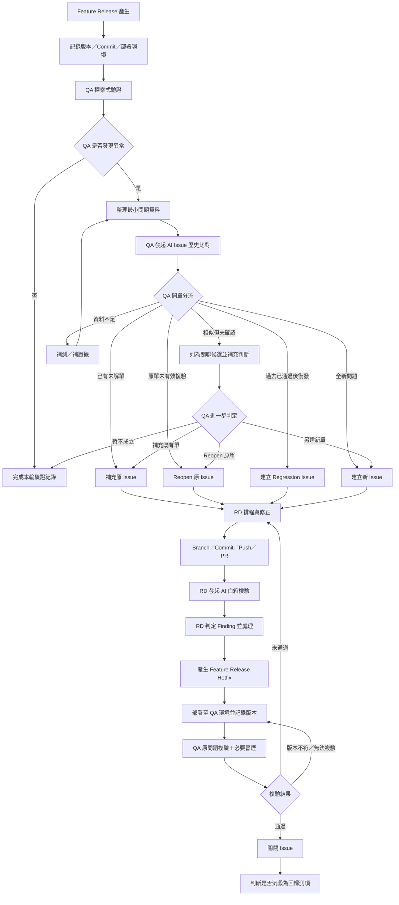

# WCMS QA／RD／AI 協作與開單驗證生命週期

## 1. 背景與目標

### 1.1 現況背景

WCMS 目前從網站內容管理出發，逐步往具備業務流程、狀態流轉、資料治理、權限、歷程與維運能力的系統發展。

目前品質流程面臨下列現實限制：

- RD 解單量能不足，既有 Issue 尚有大量待處理項目。
- QA 量能不足，現階段以探索式測試為主要人工測試方式。
- 過去正式測項與回歸題庫不足，許多品質資訊只存在於問題單、截圖或口頭說明。
- 過去 Branch、Commit、PR 與 Release 版本控制較不成熟，問題發生版本與修正版本不易追蹤。
- QA 問題資料尚未穩定轉換為 AI 可持續比對、白箱檢驗與回歸沉澱的資料。

### 1.2 本流程目標

本流程不追求 QA 一次測完整個系統，而是確保每一次測試與修正均能留下可重現、可追蹤、可複驗、可回歸及可供 AI 解析的品質資產。

核心目標：

1. QA 發現問題後，先由 AI 協助比對歷史 Issue，避免重複開單。
2. RD 修正後，由 AI 白箱檢驗修正完整性及相關影響。
3. 使用 Release、Hotfix、Commit 與部署版本建立可追溯修正鏈。
4. QA 將有限人工量能集中在探索式測試、實機操作及最終複驗。
5. 有效 Bug 在修正並複驗通過後，判斷是否沉澱為回歸測項。
6. AI 不自行決定開單、關單或驗收通過，最終責任仍由 QA／RD 承擔。

---

## 2. 核心角色與責任

### 2.1 QA

QA 負責使用者行為與實際環境的品質判斷。

主要責任：

- 依指定 Feature Release 進行探索式驗證。
- 保留環境、版本、Route、角色、操作步驟與證據。
- 在正式開單前發起 AI Issue 歷史比對。
- 決定新開 Issue、補充既有 Issue、重新開啟或不開單。
- 對已部署 Hotfix 進行原問題複驗及必要冒煙測試。
- 決定複驗通過、退回或需要補充資料。
- 判斷修正案例是否適合沉澱為人工回歸測項。

QA 不需要在開單前判定技術根因；可描述懷疑方向，但必須標示為推測。

### 2.2 RD

RD 負責技術判斷、修正、版本交付與白箱品質確認。

主要責任：

- 判斷問題技術歸屬、影響範圍與處理優先順序。
- 建立或使用正確修正 Branch。
- 留下 Base Commit、Head Commit、Commit Description 與 PR。
- 完成修正後發起 AI 白箱檢驗。
- 判定 AI Finding 為成立、誤判、待確認、接受風險或不適用。
- 處理本次修正直接相關且成立的 Finding。
- 產生 Feature Release Hotfix，提供版本、Commit 及部署資訊。
- 提供 QA 最小必要複驗範圍及相關風險。

### 2.3 AI

AI 在不同階段提供不同目的的輔助分析，不取代 QA 或 RD 的最終判定。

#### QA 階段：AI Issue 歷史比對

- 搜尋 Open／Closed Issue。
- 找出相同、相似、可能共用根因或過去已修正問題。
- 提醒問題資料不足。
- 提出新開、補充、Reopen、Regression 或關聯候選。
- 不得自行建立、重啟或關閉 Issue。

#### RD 階段：AI 白箱檢驗

- 依 Issue、Base／Head Commit、Diff 與 Rule Registry 檢查修正。
- 追蹤直接依賴、共用元件、Feature／Spec、API 契約及底層風險。
- 提出 Finding、影響候選及 QA 複驗建議。
- 不得將所有 Finding 自動轉成正式 Issue。
- 不得宣稱未實際執行的 Build、Freego、弱掃、實機或瀏覽器測試已通過。

### 2.4 流程維護責任

RD 負責本文件與技術流程主要維護；QA 共同審閱開單、驗證與複驗規則。

當 Issue Template、Project 欄位、Workflow 或 Release 規則調整時，必須同步檢查本文件。

---

## 3. 完整生命週期



### 3.1 流程判定原則

- QA 在正式開單前負責 AI Issue 歷史比對與開單分流。
- 相似候選不會直接進入 RD 修正，必須先由 QA 判斷要補充、Reopen、另開或暫不成立。
- 資料不足時先補測與補證據，不建立內容不足的正式 Bug。
- RD 在修正完成並 Push 後負責 AI 白箱檢驗。
- AI 歷史比對與 AI 白箱均只提供分析候選，最終決定分別由 QA 與 RD 負責。
- QA 必須在確認 Hotfix 已部署到指定環境後，才能執行正式複驗。
- Issue 只有在指定部署版本複驗通過後，才視為完成。

### 3.2 Issue 邏輯狀態

本流程先定義與工具無關的邏輯狀態；GitHub Project 欄位名稱可於後續落地時映射，不應改變下列責任。

| 邏輯狀態 | 主要責任 | 進入條件 | 離開條件 |
|---|---|---|---|
| 待歷史比對 | QA | QA 發現異常並整理最小資料 | QA 完成 AI 歷史比對 |
| 待開單判定 | QA | AI 已提出歷史比對候選 | QA 決定補充、Reopen、新開、Regression 或不開 |
| 待 RD 排程 | RD | 已有可處理的正式 Issue | RD 確認資訊足夠並排入處理 |
| 開發中 | RD | 已鎖定修正 Branch 與 Base Commit | 完成 Commit、Push／PR |
| 待 AI 白箱 | RD | 修正已 Push 且 Head Commit 明確 | RD 完成白箱判定與必要修正 |
| 待 Hotfix | RD | 本次直接相關 Finding 已收斂 | 修正被包入可追溯 Hotfix |
| 待部署 | RD／部署人員 | Hotfix 已產生 | 指定 QA 環境完成部署並留下紀錄 |
| 待 QA 複驗 | QA | `Deployed In` 已確認 | QA 留下 `Verified In` |
| 複驗未通過 | RD | QA 在正確版本仍可重現 | RD 完成下一輪修正 |
| 已完成 | QA／指定驗收者 | `Verified In` 通過且關閉條件齊全 | 流程結束，視需要沉澱回歸測項 |

---

## 4. Release 與版本追蹤

版本號與修正版本是本生命週期的核心證據，不可只使用「已修正」「已部署」或「已更新」等文字代替。

### 4.1 五段版本鏈

| 名稱 | 定義 | 最低紀錄 |
|---|---|---|
| `Found In` | 問題在哪個 Release／環境被發現 | Feature Release、FE／BE 版本、Spec／Case、部署 Commit、環境 |
| `Fixed By` | RD 使用哪個程式變更修正 | Branch、Base Commit、Head Commit、PR |
| `Fixed In` | 修正被包入哪個 Hotfix | Hotfix 名稱、FE／BE 版本、Hotfix Commit／Tag |
| `Deployed In` | Hotfix 實際部署到哪裡 | 環境、部署版本、部署 Commit、部署時間 |
| `Verified In` | QA 實際在哪個版本複驗 | 環境、FE／BE 版本、部署 Commit、複驗結果、證據 |

### 4.2 版本鏈判定原則

- `Fixed By` 完成，只代表程式已修正，不代表 QA 環境已更新。
- `Fixed In` 完成，只代表修正已被包入 Hotfix，不代表已部署。
- QA 只能在 `Deployed In` 已確認後執行正式複驗。
- `Verified In` 必須對應 QA 實際操作的部署版本。
- 測試環境版本與 RD 修正版本不同時，不得判定修正失敗或 Regression。
- 無法確認部署 Commit 時，複驗結果應標示為待確認，不得直接關閉。

### 4.3 Release 與 Hotfix

#### Feature Release

可供 QA 驗證的一組功能版本，至少應能對應：

- FE 版本。
- BE 版本。
- Spec／Case。
- Git Commit 或 Tag。
- 部署環境。

#### Feature Release Hotfix

針對已發布 Feature Release 的缺失修正版本。

Hotfix 必須能追溯：

- 關聯 Issue。
- 修正 Commit／PR。
- AI 白箱檢驗結果。
- FE／BE Hotfix 版本。
- 部署環境與 Commit。

---

## 5. QA 探索式驗證

### 5.1 現階段策略

由於 QA 量能有限且既有正式測項不足，QA 以探索式測試作為主要人工測試方式。

探索式測試優先確認：

- 主要使用流程是否可完成。
- 近期新增或修改功能。
- 前台 AA、SSR、CSR、多語系及相容性高風險區。
- 後台 CRUD、表單、權限、錯誤訊息及前後台連動。
- 共用元件、底層修改可能影響的使用情境。

### 5.2 QA 發現問題時的最小資料

開啟 AI 歷史比對前，至少整理：

- 功能／模組。
- 前台或後台。
- `Found In` Release／版本／環境。
- Route 或功能位置。
- 瀏覽器、裝置、語系、帳號角色。
- 重現步驟。
- 預期結果。
- 實際結果。
- 可重現性。
- 截圖、影片、Console、Network 或 Log。

資料不足時，AI 應先指出缺口，QA 再決定是否補測。

---

## 6. QA Gate：AI Issue 歷史比對與開單分流

### 6.1 執行時點

AI Issue 歷史比對發生於正式開單前，由 QA 發起並負責最終分流。

### 6.2 比對範圍

AI 應檢查：

- Open Issue。
- Closed Issue。
- Issue 標題、描述、錯誤訊息、模組、Route 與附件說明。
- 原修正 Commit／PR。
- 原部署與複驗紀錄。
- 既有回歸測項或相關白箱規則。

### 6.3 分流結果

#### A. 已有未解 Issue

處理：

- 不建立重複 Issue。
- 將本次發生版本、環境、步驟與證據補到原 Issue。
- 若實際現象或影響範圍不同，標示差異供 QA／RD 判斷。

#### B. 原 Issue 未完成有效複驗

判斷條件例如：

- 只有 Closed 狀態，沒有 `Verified In`。
- 沒有 QA 複驗結果。
- 沒有部署版本或測試環境證據。

處理：

- 優先 Reopen 原 Issue。
- 補入本次 `Found In` 與證據。
- 不直接稱為 Regression。

#### C. 已確認修正後再次發生

成立條件：

- 過去存在明確 `Verified In` 通過證據。
- 後續 Feature Release 再次發生相同行為。

處理：

- 建立新的 Regression Issue。
- 關聯原 Issue、原修正版本及本次 `Found In`。
- 不破壞原 Issue 已完成的歷史紀錄。

#### D. 相似問題但尚未確認同一根因

處理：

- 列為相關 Issue 或候選影響。
- AI 不得自行判定為相同 Bug。
- 不直接進入 RD 修正，也不因相似就自動建立新 Issue。
- QA 應依操作情境與補測結果，決定補充既有 Issue、Reopen、另開新 Issue 或暫不成立。

#### E. 全新問題

處理：

- 使用 QA Bug Form 建立新 Issue。
- 填寫 `Found In` 與必要證據。

#### F. 資料不足

處理：

- 暫不建立正式 Bug。
- 先補充測試環境、步驟、結果或附件。

### 6.4 AI 歷史比對輸出格式

```text
【比對結論】
已有未解／疑似未有效複驗／疑似 Regression／相似候選／新問題／資料不足

【高相關 Issue】
#Issue：相關原因

【版本判斷】
過去修正版本：
過去複驗版本：
本次發生版本：

【建議處理】
補充／Reopen／建立 Regression／建立新 Issue／補資料

【信心程度】
高／中／低

【仍需 QA 判斷】
...
```

AI 輸出只是候選建議，QA 才能執行新開、補充、Reopen 或不開單。

---

## 7. Issue 建立與最低紀錄

### 7.1 Issue 標題

建議格式：

```text
【模組／功能】異常現象
```

Regression 可使用：

```text
[Regression]【模組／功能】異常現象於指定 Release 復發
```

### 7.2 QA 開單最低欄位

- 測項類型。
- 嚴重度。
- 可重現性。
- `Found In`。
- 測試環境。
- 功能位置／Route。
- 重現步驟。
- 預期結果。
- 實際結果。
- 附件／錯誤紀錄。
- AI 歷史比對結論。
- 原始／相關 Issue。

### 7.3 欄位品質

以下內容不視為充分紀錄：

- 「如上述」。
- 「請看附件」。
- 「功能有問題」。
- 只有截圖，沒有操作步驟。
- 只有錯誤訊息，沒有發生版本與環境。

附件必須搭配文字說明其對應步驟與異常位置。

### 7.4 一張 Issue 的問題範圍

原則：同一根因且可由同一修正、同一部署、同一驗收完成者，可使用一張主 Issue。

以下情況應考慮拆單：

- 不同入口或不同 API。
- 不同修正單元。
- 不同部署時程。
- 不同驗收條件。
- 其中一項可關閉、另一項仍需持續處理。

---

## 8. Backlog 與優先順序控制

### 8.1 Severity 與 Priority 分離

Severity 表示問題影響程度；Priority 表示團隊何時處理。

建議：

- Severity 由 QA 初判，RD 可調整。
- Priority 由 RD／協作窗口依 Release、風險與量能排定。

不得只用 Severity 直接等同處理順序。

### 8.2 避免重複 Backlog

QA 開單前的 AI 歷史比對，用於降低：

- 重複開單。
- 已有未解問題被重新建立。
- 已修正問題復發但未關聯。
- 同一問題因不同標題形成多張單。

### 8.3 避免 AI 產生第二個巨大 Backlog

AI 白箱找到的相關功能或可能風險，預設先記錄為：

- 可能共用根因。
- 相關功能候選。
- 建議 QA 複驗範圍。
- 技術債候選。
- 待確認 Finding。

只有符合下列條件，才另建正式 Issue：

1. 已確認可獨立重現。
2. 已確認是不同根因或不同修正單元。
3. 無法與本次 Issue 一起驗收或關閉。
4. 不處理會形成獨立且明確的產品風險。
5. 已由 QA 或 RD 確認需另行排程。

AI 不得因搜尋到十個相似程式或頁面，就自動建立十張 Issue。

---

## 9. RD 修正流程

### 9.1 開始修正前

RD 應確認：

- Issue 是否已具備足夠重現資訊。
- `Found In` 是否明確。
- 是否已有重複或關聯 Issue。
- 修正所屬 Branch。
- 本次 Base Commit。
- 可能涉及前端、後端、DB、Feature、Spec 或 SysCore。

### 9.2 Commit 與 PR

修正應遵循 Git／Commit 規範：

- Commit 對應 Issue。
- Description 說明問題根源、修改內容、影響範圍、未包含範圍及驗證狀態。
- 未實際執行的驗證不得描述為已通過。
- Push／PR 後記錄 Head Commit。

相關規範：

- `../../01_研發與技術文件/02_開發規範/04_Git與Commit規範.md`

### 9.3 RD 回覆最低內容

```text
【問題根源】

【修改內容】

【影響範圍】

【未包含範圍】

【Fixed By】
Branch：
Base Commit：
Head Commit：
PR：

【實際執行驗證】

【未執行驗證】
```

---

## 10. RD Gate：AI 白箱檢驗

### 10.1 執行時點

RD 完成修正、Commit 與 Push 後，發起 AI 白箱檢驗。

AI 白箱不應在沒有明確 Code Commit 的狀況下宣稱完成修正驗證。

### 10.2 輸入資料

- 原 Issue。
- Base Commit。
- Head Commit。
- Commit Summary／Description。
- 實際 Diff。
- 相關架構與開發規範。
- `RULE_REGISTRY.yml`。

### 10.3 檢查方向

- 修正是否對應 Issue。
- 是否處理根因，而非只遮蔽畫面現象。
- 是否漏改直接依賴或引用端。
- 是否影響 Feature／Spec／SysCore。
- API Request／Response、OpenAPI 與型別是否一致。
- AA、SSR／Hydration、多語系、權限、Cache、Auditing 風險。
- 是否新增重複或平行實作。
- QA 應執行的最小複驗與冒煙範圍。

### 10.4 RD 判定

每項 Finding 由 RD 判定：

- 成立。
- 誤判。
- 待確認。
- 接受風險。
- 不適用。

與本次修正直接相關且成立的 Finding，原則上應在本次 Hotfix 前處理。

其他低信心、獨立技術債或無法重現項目，不得自動轉成正式 Issue。

### 10.5 正式規範來源

AI 白箱完整格式、Rule、證據與複驗方式，以以下文件為準：

- `../01_AI白箱檢測/README.md`
- `../01_AI白箱檢測/RULE_REGISTRY.yml`

QA 文件只定義其在整體生命週期中的責任與介接點，不重複建立另一套白箱規則。

---

## 11. Feature Release Hotfix 與部署

### 11.1 Hotfix 產生條件

至少應具備：

- 關聯 Issue。
- `Fixed By`。
- AI 白箱已執行或明確標示未執行原因。
- RD 已處理本次直接相關的成立 Finding。
- FE／BE 版本已更新。
- 交付或部署內容可追溯至 Commit。

### 11.2 Hotfix 紀錄

```text
【Fixed In】
Hotfix 名稱：
FE 版本：
BE 版本：
Spec／Case：
Commit／Tag：
包含 Issue：
```

### 11.3 部署紀錄

```text
【Deployed In】
環境：
部署網址：
FE 版本：
BE 版本：
部署 Commit：
部署時間：
部署人員：
```

QA 複驗前必須確認部署版本已更新。

---

## 12. QA 複驗與關單

### 12.1 複驗範圍

QA 至少執行：

1. 原 Issue 重現步驟。
2. RD／AI 提出的必要關聯範圍。
3. 主要流程冒煙測試。
4. AI 無法確認的實際瀏覽器、裝置、AA 或使用者體感項目。

### 12.2 複驗結果

- 通過。
- 未通過。
- 部分通過。
- 無法複驗。
- 版本不符。
- 需求待確認。

### 12.3 QA 複驗紀錄

```text
【Verified In】
環境：
FE 版本：
BE 版本：
部署 Commit：
複驗日期：
複驗人員：

【原問題結果】
通過／未通過／部分通過／無法複驗

【必要關聯範圍】

【證據】

【是否可關閉】
是／否
```

### 12.4 未通過

- 補充新的實際結果與證據。
- 不覆蓋原始問題紀錄。
- 確認測試版本是否與 `Deployed In` 一致。
- 回到 RD 修正流程。
- 同一 Hotfix 首次複驗失敗，不稱為 Regression。

### 12.5 關閉條件

Issue 關閉前至少應具備：

- 關聯修正 Commit／PR。
- `Fixed In`。
- `Deployed In`。
- `Verified In` 通過證據。
- QA 或指定驗收者確認。

只有 Closed 狀態而沒有以上證據，不代表已完成有效複驗。

---

## 13. Regression 與回歸測項沉澱

### 13.1 Regression 定義

真正的 Regression 必須同時具備：

1. 過去版本已有明確修正與 QA 複驗通過證據。
2. 後續 Release 再次發生相同行為。

若過去只有 Closed Issue，但無 `Verified In`，應優先視為原 Issue 未有效完成，而不是 Regression。

### 13.2 探索式問題轉回歸資產

```text
探索式測試
→ 發現 Bug
→ Issue 修正
→ AI 白箱
→ Hotfix 部署
→ QA 複驗通過
→ 判斷是否高價值
→ 建立或補強回歸測項
```

### 13.3 適合沉澱的案例

- 曾經復發。
- 主要流程。
- 登入、帳號、角色或權限。
- 新增、修改、刪除、儲存與資料一致性。
- 共用元件或底層邏輯。
- 跨 Feature／Spec。
- 多語系。
- SSR／Hydration。
- AA 鍵盤與焦點。
- 高風險瀏覽器、手機或 LINE 內建瀏覽器。
- 資料遺失、錯誤保存或安全問題。

### 13.4 回歸測項最低欄位

- 測項 ID。
- 測試目的。
- 來源 Issue。
- 適用模組／功能。
- 前置條件。
- 最小操作步驟。
- 預期結果。
- 適用瀏覽器／裝置／角色／語系。
- 風險等級。
- 首次修正版本。
- 最近通過版本。
- AI 白箱 Rule 或檢查關聯。
- 是否可由 AI 靜態初檢。
- 必須人工驗證的項目。

### 13.5 AI 白箱與 QA 功能回歸的邊界

AI 白箱可作為回歸保護的第一層，但不等於實際功能回歸已通過。

- AI 白箱：檢查程式結構、Diff、契約、引用、規則與風險。
- QA 功能回歸：實際操作瀏覽器、裝置、角色、資料與流程。

未來回歸策略應採：

```text
AI 先縮小人工回歸範圍
→ QA 驗證 AI 無法確認的實際行為
```

---

## 14. 測試方向

### 14.1 前台

- AA：鍵盤、Focus、Label、Alt、語意結構與錯誤提示。
- SSR／CSR：直接開 URL、重新整理、站內切頁、Hydration 與資料一致性。
- Freego／SEO：原始 HTML、Meta、Title、Lang 與 Route。
- 多語系：切換、Fallback、Route、固定文字與內容一致性。
- RWD／UX：桌機、手機、平板與閱讀順序。
- 檔案與外部內容：預覽、下載、iframe、影片與外部連結。
- 相容性：Chrome、Edge、Safari、手機、LINE 內建瀏覽器。

### 14.2 後台

- CRUD：新增、編輯、刪除、查詢、排序與分頁。
- Form：必填、格式、日期、URL、檔案、長度與特殊字元。
- 權限／登入：JWT、逾時、角色、前端隱藏與後端驗證。
- Toast／Error：本地欄位提示、API 錯誤與系統例外。
- 前後台連動：資料、圖片、檔案、上下架與排序。
- Cache／資料一致性：儲存後是否可立即正確查詢與呈現。

### 14.3 共通與底層

- API 契約。
- 共用 Component／Hook／Form／Grid。
- File、Image、TinyMCE、LangLink。
- SSR Route／Loader／Cache。
- Feature／Spec／SysCore 分層。
- 權限、安全與 Auditing。
- 重複或平行實作。

### 14.4 非功能測試

- AA：工具檢測與人工鍵盤操作均需保留。
- 相容性：實機或指定瀏覽器確認。
- 弱點掃描：另列專項，結果需正式追蹤。
- 效能／壓力：另列專項，不等同欄位邊界值測試。
- 維運／健康檢查：依環境成熟度逐步建立。

---

## 15. AI 與人工驗證邊界

### 15.1 AI 適合協助

- Issue 歷史搜尋與語意比對。
- 問題分類與缺少欄位提醒。
- Source Code 與 PR Diff 檢查。
- API Payload／Response 與型別比對。
- Route、Loader、Component、Hook 關聯追蹤。
- 共用層與 Feature／Spec 影響範圍。
- 靜態 AA、SSR、多語系、權限與 Cache 風險。
- 產生 QA 複驗建議與回歸測項初稿。

### 15.2 必須由人工確認

- 實際瀏覽器與裝置行為。
- 鍵盤操作、Focus 順序與 AA 體感。
- RWD、操作手感與 UX。
- Safari、手機及 LINE 內建瀏覽器。
- Freego 實際檢測結果。
- 檔案上傳、下載、影片、iframe 與外部資源。
- 客戶情境、需求合理性與最終驗收。
- 部署環境是否真正使用指定版本。

### 15.3 AI 誠實性規則

AI 必須區分：

- 已由程式證據確認。
- 高信心推論。
- 需要人工驗證。
- 無法確認。

不得把「源碼看起來正確」描述為「實機測試已通過」。

---

## 16. Legacy Issue 過渡方式

既有 Issue 不要求一次補齊所有新欄位。

採「重新處理時再補」原則：

```text
Legacy Issue 被排入處理
→ 補目前狀態與關聯 Issue
→ 補本次 Found In
→ 鎖定 Base／Head Commit
→ 從本次修正開始走新流程
```

尚未排程的舊 Issue 保留原始證據即可，由人工逐步整理。

舊 Issue 若無原修正版本及有效複驗證據，不得直接判定為 Regression。

---

## 17. 現有 GitHub 實作與後續落地

### 17.1 目前已有

- QA Bug Issue Form。
- Feature／Story Issue Form。
- 測項類型、嚴重度、可重現性欄位。
- Issue 自動加入 GitHub Project。
- Workflow 同步部分 QA 欄位至 Project。
- QA 已開始以探索式測試建立 Issue。
- RD 已開始以 Commit／PR 關聯部分 Issue。

### 17.2 尚待落地

- AI 歷史比對結果欄位或固定留言格式。
- `Found In`、`Fixed By`、`Fixed In`、`Deployed In`、`Verified In`。
- Regression／Reopen／相關候選的正式分流規則。
- QA 複驗固定格式。
- Release／Hotfix 與部署版本紀錄。
- 回歸測項清冊。
- Project 狀態生命週期。
- Story 欄位同步。
- Workflow Pagination、Retry、Concurrency 與 Token 維運規範。

本文件先完成流程與責任定義，再分階段修改 Issue Template、Project 與 Workflow，避免先把尚未收斂的流程自動化。

---

## 18. 第一版導入範圍

本文件 `1.0.0` 先讓下列流程正式運作：

1. Feature Release 具備可辨識版本與部署 Commit。
2. QA 以探索式測試發現問題。
3. QA 開單前使用 AI 歷史比對。
4. QA 決定新開、補充、Reopen 或 Regression。
5. RD 使用 Branch、Commit、PR 修正。
6. RD 修正後執行 AI 白箱。
7. Hotfix 記錄 FE／BE 版本與 Commit。
8. QA 確認部署版本後複驗。
9. 通過後關閉 Issue。
10. 高價值案例轉為回歸測項。

第一階段不要求：

- 一次整理所有 Legacy Issue。
- 一次建立所有回歸測項。
- AI 自動開單或關單。
- CI 完整自動化所有 Gate。
- QA 完整人工回歸全站。

---

## 19. 一句話流程定義

> Feature Release 後由 QA 進行探索式驗證；發現問題時，QA 先使用 AI 比對歷史 Issue，再決定補單、重啟、建立 Regression 或新開 Issue。RD 完成修正後，使用 AI 白箱檢驗修正完整性與相關影響，產生可追溯的 Feature Release Hotfix。Hotfix 部署後由 QA 在指定版本進行複驗，通過才關閉 Issue，並將高價值案例沉澱為後續回歸測項。

---

## 20. 第二階段待確認事項

本文件自 `1.0.0` 起作為第一版正式流程使用；下列項目屬第二階段落地與細化工作，不影響本版核心生命週期：

- GitHub Project 正式狀態名稱與轉換責任。
- Priority 分級與排程責任。
- `Found In` 等版本欄位應使用 Issue Form、Project 欄位或固定留言。
- QA AI 歷史比對的固定 Prompt 與輸出保存位置。
- Regression Case Registry 的檔案格式與 ID 規則。
- Hotfix 版本命名與 FE／BE／Spec 的組合規則。
- 哪些 Severity 會阻擋 Release 或 Hotfix。
- QA 複驗通過後由誰執行關單。
