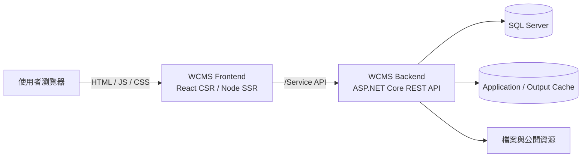

# WCMS

> Web Content Management System

WCMS 是一套前後端分離的網站內容管理系統翻新專案，整合前台網站、後台管理、CSR／SSR、多國語系、無障礙與專案客製化能力。

目前共用功能與架構開發以 `Feature/Dev` 為主要核對分支；實際工作前仍須確認本次來源分支、目標分支與 Spec 範圍。

> [!IMPORTANT]
> 本 README 僅提供專案入口與快速導覽。完整架構、開發規範、品質驗證與資料來源規則，請由 [`Docs/README.md`](./Docs/README.md) 進入。

## 專案目標

- 建立可供多站台共用、並允許個別專案延伸的 WCMS 架構。
- 支援前台 CSR 與 SSR，供一般瀏覽及 Freego 等檢測情境使用。
- 納入 AA 無障礙、多國語系、權限、安全與弱點掃描要求。
- 以 Feature 作為共用能力，透過 Spec 延伸個別客戶或站台需求。
- 目前以前後端 RESTful API 對接為主，GraphQL 為中後期評估方向。

## 目前技術基準

| 領域 | 目前基準 |
|---|---|
| 前端 | React 18、TypeScript 5.8、Vite 6、React Router 6 |
| 前端執行模式 | CSR、Node／Express SSR、Hydration |
| 前端執行環境 | Node.js 22.16.x、npm 10.9.x |
| 後端 | ASP.NET Core Web API、.NET 10 |
| 資料存取 | Entity Framework Core 10、SQL Server |
| API | RESTful API、Swagger／OpenAPI；前端型別由 OpenAPI Schema 產生 |
| 身分驗證 | JWT、Cookie、後端 Token State Cache |
| 品質要求 | AA、SSR／CSR 一致性、Freego、弱點掃描、多國語系 |
| Cache | 應用程式 Cache、Output Cache；Redis／Container 化仍屬後續規劃 |

實際套件與版本以 [`WCMS_Frontend/package.json`](./WCMS_Frontend/package.json) 與 [`WCMS_Backend/WCMS.csproj`](./WCMS_Backend/WCMS.csproj) 為準。

## 系統關係



詳細請求流程、Feature／Spec 邊界與模組責任，請參閱 [`WCMS 整體專案架構`](./Docs/01_研發與技術文件/01_系統架構/01_整體專案架構.md)。

## Repository 結構

```text
WCMS/
├─ WCMS_Frontend/                 # React 前台、後台、CSR／SSR 與前端 Spec
├─ WCMS_Backend/                  # ASP.NET Core API、SysCore、Feature 與後端 Spec
├─ Docs/                          # 架構、規範、品質驗證與交付文件
└─ readme.md                      # Repository 快速入口
```

前後端皆以共用 Feature 為主線，個別專案差異放在對應的 `SpecFeatures` 範圍。不得在未確認既有 Library、Hook、Template、FeatureDriver、Service 或相近 Spec 前，建立重複的平行實作。

## 分支角色

| 分支 | 主要用途 |
|---|---|
| `main` | Repository 預設分支；不可直接視為最新開發進度 |
| `Feature/Dev` | 共用 Feature、SysCore、架構與一般功能開發 |
| `Feature/Release` | 發布前整合、版本確認、發布資料整理與必要 Hotfix |
| `Spec####` | 個別客戶、站台或客製需求 |

Branch、Commit、Issue 與 PR 規則，以 [`Git 與 PR 規範`](./Docs/01_研發與技術文件/02_開發規範/04_Git與PR規範.md) 為準。

## 開發環境

### 前端

```powershell
cd WCMS_Frontend
npm ci
npm run dev
```
常用檢查與建置：

```powershell
npm run typecheck
npm run check
npm run build
```

### 後端

```powershell
cd WCMS_Backend
dotnet restore
dotnet run
```

後端會依環境設定檔中的 `SpecCode` 處理 SpecFeatures 條件編譯。執行前須確認：

- SQL Server 連線與必要設定已完成。
- 開發環境設定檔未包含可提交的密碼、Token 或其他 Secret。
- 本次啟動的 SpecCode 與目標專案一致。

> [!NOTE]
> 部署、IIS、資料庫 Migration 與既有資料升級流程，不再直接維護於根 README，避免與實際腳本及正式文件產生版本落差。

## 文件入口

### AI／整體分析

- [`WCMS AI 專案資料讀取入口`](./Docs/WCMS_AI資料讀取入口.md)
- [`WCMS Docs`](./Docs/README.md)

### 系統架構

- [`整體專案架構`](./Docs/01_研發與技術文件/01_系統架構/01_整體專案架構.md)
- [`前端專案架構`](./Docs/01_研發與技術文件/01_系統架構/02_前端專案架構.md)
- [`後端專案架構`](./Docs/01_研發與技術文件/01_系統架構/03_後端專案架構.md)

### 開發規範

- [`共通開發規範`](./Docs/01_研發與技術文件/02_開發規範/01_共通開發規範.md)
- [`前端開發規範`](./Docs/01_研發與技術文件/02_開發規範/02_前端開發規範.md)
- [`後端開發規範`](./Docs/01_研發與技術文件/02_開發規範/03_後端開發規範.md)
- [`Git 與 PR 規範`](./Docs/01_研發與技術文件/02_開發規範/04_Git與PR規範.md)

### 品質與版本資料

- [`品質與驗證文件`](./Docs/03_品質與驗證文件/README.md)
- [`開發歷程與版本紀錄`](./Docs/01_研發與技術文件/03_開發歷程與版本紀錄/README.md)

## 資料來源原則

資料發生落差時，依責任判斷：

1. 程式目前如何運作：以 GitHub 指定分支的程式碼與設定為準。
2. 系統應如何設計與開發：以 `Docs` 內有效的 Markdown 為準。
3. 待辦、收斂與複驗狀態：以 Google Sheet「WCMS_整合收斂管理表」最新內容為準。
4. 某次修改的原因與範圍：以 Commit、PR、Issue 與相關決策紀錄為準。
5. Word、Excel、PowerPoint、PDF 與 ZIP：作為交付、報告、快照或指定版本的輔助資料。

發現程式、文件與管理資料不一致時，應明確指出差異，不得直接假設三者已同步。

## 專案狀態說明

WCMS 目前仍持續進行架構收斂、Feature／Spec 整合、API 契約、品質流程與安全驗證。文件中標示為「規劃中」、「待驗證」或「尚未全面落地」的內容，不得視為已完成。

未實際執行 Build、測試、Freego、弱點掃描或部署時，也不得宣稱相關項目已通過。
